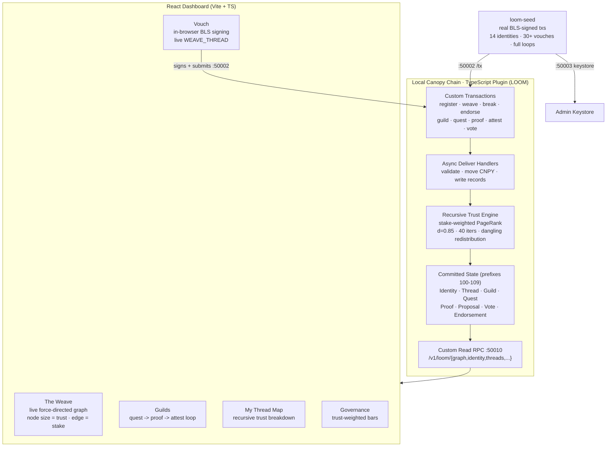

# LOOM
### Recursive Trust, Drawn as a Shape — A SocialFi Protocol on Canopy


> **Trust isn't a score. It's a shape.**

Every reputation system on-chain is a flat number you can buy your way into. Stake more, count more. That's not trust — that's a balance. LOOM makes a vouch *recursive*: backing from a node the network already trusts moves you far more than backing from a wallet minted five seconds ago. The weight of who-trusts-you is itself defined by who-trusts-them, all the way down — computed live, on-chain, on every relevant transaction.

The homepage **is** that computation, rendered: a living force-directed graph where the nodes the network believes in glow gold and pull everything toward them.

Not a follower count. Not a token balance. A trust **topology**.

---

## Live Resources

| Resource | Link |
|---|---|
| **GitHub** | https://github.com/0xkinno/loom |
| **Demo video** | _<add local-node screen recording>_ |
| **Network** | Local Canopy chain · TypeScript plugin |
| **Read RPC** | `:50010/v1/loom/*` · Tx/Query `:50002` · Admin keystore `:50003` |
| **Discord build channel** | `#1445423487106809918` |

---

## The Problem

Three things make on-chain reputation fake, and LOOM is the direct answer to all three.

**1. Trust is flat.** Every competitor weights a vouch the same whether it comes from a founder or a fresh Sybil. One wallet, one unit of trust — so trust is just a wealth or headcount proxy wearing a costume.

**2. Sybil resistance is an afterthought.** If trust doesn't *flow* from already-trusted nodes, spinning up 500 wallets to endorse each other works. Flat-weight graphs have no defense; recursive graphs make those 500 wallets worth almost nothing because nobody trusted *them* first.

**3. The shape is invisible.** Even when the data exists on-chain, no interface turns the adjacency of who-backs-whom into something you can *look at* and reason about. The most decision-relevant structure in the system is the one nobody renders.

---

## The Solution

```
┌──────────────────────────────────────────────────────────────────────────────┐
│                                LOOM PIPELINE                                 │
├────────────┬─────────────┬──────────────┬─────────────┬──────────────────────┤
│  REGISTER  │   WEAVE     │  RECOMPUTE   │    GATE      │      GOVERN          │
├────────────┼─────────────┼──────────────┼─────────────┼──────────────────────┤
│ Identity   │ Staked,     │ Stake-       │ Guild join  │ Vote weight =        │
│ minted on  │ directed    │ weighted     │ blocked     │ recursive trust at   │
│ chain with │ vouch       │ PageRank     │ below a     │ the casting block —  │
│ base trust │ (WEAVE_     │ over the     │ minimum     │ a hub outweighs a    │
│ 1.00       │ THREAD)     │ FULL graph,  │ trust gate; │ crowd of leaves;     │
│            │ escrows     │ written back │ attestation │ Sybils carry near    │
│            │ CNPY        │ to state     │ auto-weaves │ zero                 │
│            │             │ every change │ a rep edge  │                      │
└────────────┴─────────────┴──────────────┴─────────────┴──────────────────────┘
```

The core idea: **trust is computed once, in one deterministic place on-chain, and every surface — node size, edge weight, guild gate, vote tally — reads the same number.** Nothing is restyled per screen; nothing can disagree with itself.

---

## Architecture



---

## The 10 Custom Transaction Types

| # | Type | What it does |
|---|---|---|
| 1 | `REGISTER_IDENTITY` | Mints an on-chain identity (handle, bio) with base trust 1.00 |
| 2 | `WEAVE_THREAD` | A **staked, directed vouch** — escrows CNPY, creates a trust edge |
| 3 | `BREAK_THREAD` | Severs a vouch — returns 90% of stake, burns 10% as bad-faith penalty |
| 4 | `ENDORSE_SKILL` | Tags a peer with a skill, weighted by the endorser's recursive trust |
| 5 | `FORM_GUILD` | Creates a trust-gated collective with a `minTrust` threshold |
| 6 | `JOIN_GUILD` | Join — **rejected on-chain** if your recursive trust is below the gate |
| 7 | `POST_QUEST` | A guild member posts a bounty with a CNPY reward |
| 8 | `SUBMIT_PROOF` | Submit proof-of-work against a quest |
| 9 | `ATTEST_CONTRIBUTION` | Peer review; **approval auto-weaves a reputation thread** to the author |
| 10 | `CAST_WEIGHTED_VOTE` | One identity, one vote — weighted by recursive trust at the casting block |

All ten are declared in `ContractConfig.supportedTransactions` and decoded in `FromAny`. Custom state lives under prefixes `100-109` (core reserves `1-15`), declared in `customStatePrefixes` so Canopy's handshake validates them.

---

## The Recursive Trust Engine

The whole thesis lives in one function, `recomputeTrust()`, run inside the async deliver handlers (**not** `EndBlock` — Canopy calls `EndBlock` synchronously, so awaited state writes can't go there).

```
For the full identity set and every active thread:

  edge weight        w(u->v) = stake(u->v)              (min 1, so no zero-mass)
  out-weight         W(u)    = sum of w(u->.)

  power iteration (damping d = 0.85, 40 iterations):
      score(v) <- (1 - d)/N
                  + d * sum_u  score(u) * w(u->v) / W(u)   over backers u
                  + d * (dangling mass) / N                redistributed evenly

  trust_score(v) = round( score(v) * N * 1e6 )           fixed-point, avg node ~= 1.00
```

Recomputed on `REGISTER_IDENTITY`, `WEAVE_THREAD`, `BREAK_THREAD`, and approved `ATTEST_CONTRIBUTION` — i.e. every time the graph's shape actually changes. Stored back with each node's in/out degree and inbound stake, so the UI never has to recompute anything.

**Why this beats flat-weight competitors:** a vouch from a 3.40-trust hub injects `3.40 x stake` of pull; the same stake from a 0.05 leaf injects almost nothing. 500 mutually-endorsing Sybils form a closed loop the dangling-mass term and damping starve out — their scores collapse toward `(1-d)/N`.

---

## The Dashboard

### The Weave — the signature
The homepage is the live trust graph. A hand-built force-directed SVG (d3-force), one node per identity, sized and glowing by recursive trust — gold above the 78th percentile, green below. Edges are vouches: thickness scales with stake, broken threads render dashed red. Drag nodes, click to open a detail card with the node's recursive score, degree, and inbound stake.

### Vouch — the one live write path
Pick a signer, pick who to back, set the stake and skill. LOOM fetches that identity's BLS key from the local keystore, **signs the `WEAVE_THREAD` in the browser** (`@noble/curves`), and submits to `:50002`. On commit the engine re-scores the whole graph and both nodes visibly shift. A projected-pull preview shows how much the signer's own trust amplifies the vouch *before* you sign.

### Guilds — the reputation loop
Trust-gated collectives. Each shows its `minTrust` gate and members. Inside: quests become proof-of-work, and a peer attestation auto-weaves a reputation thread back to the author — visible as a new edge on The Weave.

### My Thread Map — the breakdown
Pick any identity and see its personal subgraph plus a ranked breakdown of *where its trust comes from* — each inbound thread weighted by the backer's own score, as a percentage. This is the recursive idea made legible: you can read, line by line, why a node is trusted.

### Governance — the payoff
Proposals tallied by **summed recursive trust, not headcount**. Yes/no bars in CNPY-weight. One trusted hub visibly outweighs a crowd of fresh wallets — the reason recursive trust matters, shown in one screen.

---

## Trust Gate & Penalty Parameters

| Parameter | Value | Where |
|---|---|---|
| Base trust (new identity) | `1.00` (1e6 fixed-point) | `contract.ts` |
| PageRank damping | `0.85` | `recomputeTrust()` |
| Power iterations | `40` | `recomputeTrust()` |
| High-trust (gold) cutoff | top **78%** of max trust | UI + mirrors gate intent |
| `BREAK_THREAD` refund / penalty | **90% / 10%** | penalty -> fee pool |
| Bond pool id (stake escrow) | `424242` | core Pool keyspace |
| Custom state prefixes | `100-109` | `customStatePrefixes` |

One file decides what "trusted" means; every panel reads from it.

---

## What's real vs. seeded

LOOM has **no simulated data path at all** — unlike a terminal sitting on someone else's protocol, LOOM *is* the chain logic, so every value is committed state.

| Piece | Status |
|---|---|
| Identity, vouch, guild, quest, proof, attestation, vote records | **Real** — committed Canopy state, read via custom RPC |
| Recursive trust scores | **Real** — computed on-chain by the plugin, written to state |
| Initial demo graph (14 identities, 30+ vouches, full loops) | **Real, seeded** — every seed line is a genuine BLS-signed tx, not a fixture |
| In-browser vouch | **Real** — signs with `@noble/curves`, submits to `:50002`, re-scores live |
| Frontend when node is offline | **Honest empty state** — shows a connect prompt, never invents data |

If the node is unreachable, LOOM tells you. It never fakes a graph.

---

## Tech Stack

| Layer | Technology |
|---|---|
| Chain | Local Canopy node, TypeScript plugin template |
| Custom logic | TypeScript — 10 tx types, PageRank trust engine, custom read RPC |
| Signing | BLS12-381 long signatures via `@noble/curves` (seed **and** browser) |
| Encoding | `protobufjs` static module (shared proto bundle) |
| Frontend | React 18, TypeScript, Vite |
| Graph | Hand-built force-directed SVG with `d3-force` (no charting library) |
| Styling | Hand-written CSS design tokens — organic-green dark system, no UI framework |

---

## Running Locally

> Prereqs: Go toolchain + Node >= 20, and a cloned `canopy-network/canopy` you can build.

### 1 — Drop LOOM into the TypeScript template
```bash
cp loom/loom-plugin/proto/tx.proto            plugin/typescript/proto/tx.proto
cp loom/loom-plugin/src/contract/contract.ts  plugin/typescript/src/contract/contract.ts
cp loom/loom-plugin/src/contract/plugin.ts    plugin/typescript/src/contract/plugin.ts
cp loom/loom-plugin/src/contract/rpc.ts       plugin/typescript/src/contract/rpc.ts
```

### 2 — Build the plugin (proto -> descriptors -> tsc)
```bash
cd plugin/typescript
npm install
npm run build:all        # must finish clean
```

### 3 — Point Canopy at it & start
```bash
# ~/.canopy/config.json  ->  "plugin": "typescript"
canopy start             # terminal 1
canopy admin ks          # terminal 2 — copy validator address (hex)
```

### 4 — Seed a real on-chain graph
```bash
cd loom/loom-seed
npm install
VALIDATOR_ADDRESS=<hex> npm run seed
curl -s localhost:50010/v1/loom/graph | jq '.stats'   # -> nodeCount 14, edgeCount 30+
```

### 5 — Run the frontend
```bash
cd loom/loom-web
npm install
npm run dev              # http://localhost:5173
```

### 6 — Push to GitHub
```bash
cd loom
git init && git add . && git commit -m "LOOM: recursive-trust SocialFi on Canopy"
git branch -M main
git remote add origin https://github.com/0xkinno/loom.git
git push -u origin main
```

---

## Project Structure

```
loom/
├── loom-plugin/                    Drop-in files for canopy/plugin/typescript/
│   ├── proto/
│   │   └── tx.proto                10 Message* tx types + 10 state records
│   └── src/contract/
│       ├── contract.ts             Config, 10 validators, 10 deliver handlers,
│       │                           recomputeTrust() PageRank engine, state keys
│       ├── plugin.ts               FromAny() wired for all 10 message types
│       └── rpc.ts                  Custom read RPC: /v1/loom/{graph,identity,...}
│
├── loom-seed/                      Real on-chain graph seeder (zero mocks)
│   ├── src/seed.ts                 BLS-signed txs: identities, vouches, guild,
│   │                               quest/proof/attest, trust-weighted votes
│   └── proto-gen/                  Shared protobuf bundle
│
├── loom-web/                       Vite + React + TS frontend
│   └── src/
│       ├── components/GraphCanvas.tsx   Force-directed trust graph
│       ├── lib/api.ts              Live RPC client (reads :50010)
│       ├── lib/tx.ts               In-browser BLS signing for live vouches
│       ├── screens/
│       │   ├── Weave.tsx           The signature graph view
│       │   ├── Vouch.tsx           Live staked-vouch signing
│       │   ├── Guilds.tsx          Quest -> proof -> attest loop
│       │   ├── ThreadMap.tsx       Recursive trust breakdown
│       │   └── Governance.tsx      Trust-weighted voting
│       ├── styles.css              Organic-green dark design system
│       └── App.tsx                 Rail nav, graph polling, net status
│
├── README.md
└── SUBMISSION.md                   One-line pitch + DoraHacks/Discord copy
```

---

## Demo Video Checklist

1. `canopy start` running + `curl .../graph | jq '.stats'` showing live committed state.
2. The Weave rendering the seeded topology — click a gold hub vs. a green leaf to show the trust gap.
3. Vouch: sign a live `WEAVE_THREAD` in-browser, then watch the graph re-score.
4. My Thread Map: the recursive breakdown of where one node's trust comes from.
5. Governance: trust-weighted bars — one hub outweighing several leaves.

---

## Business Potential

Every protocol that needs Sybil-resistant reputation — airdrops, DAO voting, under-collateralized lending, curation, guild access — hits the same wall: flat trust is gameable. LOOM's recursive trust primitive is a drop-in answer, and it's composable: guild gates, governance weight, and skill endorsements all read the same on-chain score.

**Roadmap beyond this build:**
1. **Trust-as-a-library** — extract `recomputeTrust()` so any Canopy plugin can gate on recursive trust.
2. **Temporal decay** — age out stale vouches so trust reflects the *current* shape, not history.
3. **Mainnet topology explorer** — the Weave as a public, real-time map of a live network's trust.

---

## Why LOOM Wins the Track (SocialFi)

- **Real working system** — 10 custom tx types, on-chain recursive scoring, all against a live local chain with **zero mocked data**.
- **A primitive, not a feature** — recursive trust is reusable across lending, governance, curation, and access control.
- **Technical depth** — stake-weighted PageRank with dangling-mass redistribution, computed in-plugin and gating real transactions, is a genuine mechanism-design technique, not decoration.
- **The shape is the demo** — competitors show a number; LOOM shows you the living topology that *produces* the number, and lets you change it with one signed vouch.

---

Built for the Canopy Vibe Code Contest #2 · SocialFi

*Trust isn't a score. It's a shape.*
